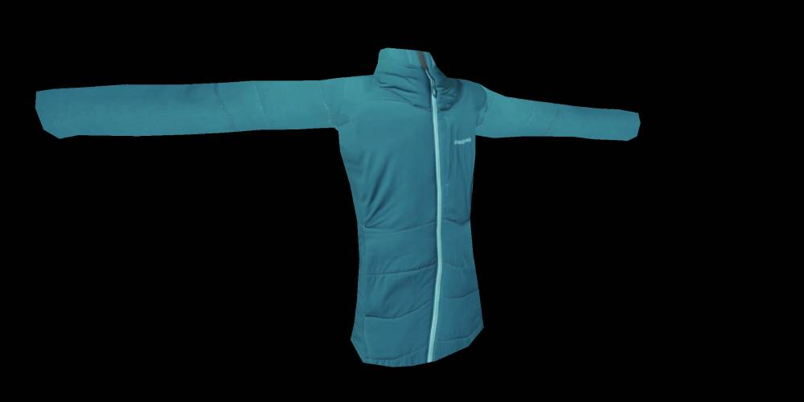

<h1 align="center">
poseNonObf | <a href="https://jadams777.github.io/poseNonObf/" target="_blank">View It<a/>
</h1>

<h3 align="center">
Same as <a href="https://github.com/jadams777/pose" target="_blank">Pose<a/> but the javascript is not obfuscated. 
</h3>

    

## Notes

- Pose Tracking with [MediaPipe](https://google.github.io/mediapipe/solutions/pose)
- Modeling with [Three.js](https://threejs.org/)
- MediaPipe API provide [33 landmarks](https://google.github.io/mediapipe/images/mobile/pose_tracking_full_body_landmarks.png)
- Each of our jacket model provide [25 landmarks](https://jadams777.github.io/poseNonObf/#debug) (debug mode)
- We also follow the [Git Flow](https://www.atlassian.com/git/tutorials/comparing-workflows/gitflow-workflow)
- Some [feature requirements](https://docs.google.com/document/d/1KZYqnk3HNr1sdZN2UB4y3WB7l_2EPOnmDhlBlcThKzE/edit)
- [Official Site](https://yukonstore.com/)

## Resources

- [Wordpress Plugin Official Guide](https://developer.wordpress.org/plugins/intro/)
- [PHP Fundamentals](https://code.tutsplus.com/courses/php-fundamentals)
- [Local Wordpress Development Tool](https://localwp.com/)
- [Woocommerce 3D Products Document](http://rcreators.com/wc_3d_products/documentation/)
- [Woocommerce 3D Products on CodeCanyon](https://codecanyon.net/item/woocommerce-3d-products/22670919)
- [3D Model Viewer by Arty](https://artystore.com/product/3d-model-viewer-wordpress-woocommerce/)
- [3D Model Viewer Plugin](https://wordpress.org/plugins/woo-3d-viewer/)
- [Add a custom button to Woocommerce product page](https://www.reddit.com/r/Wordpress/comments/9ux4kf/add_a_custom_button_to_woocommerce_product_page/)
- [Product Attachment Plugin for WooCommerce](https://wordpress.org/plugins/woo-product-attachment/)
- [WordPress Plugin Boilerplate](https://github.com/devinvinson/WordPress-Plugin-Boilerplate/)
- [WordPress Plugin Boilerplate Guide](https://www.sitepoint.com/wordpress-plugin-boilerplate/)
